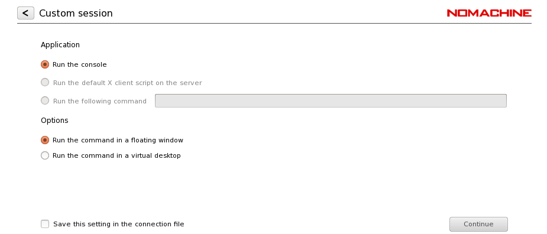

# Reference

## External Resources

### NoMachine :nomachine

NoMachine is supported on Windows, MAC and Linux computers. You can get the latest version of the enterprise client from [NoMachine download page](https://www.nomachine.com/download-enterprise#NoMachine-Enterprise-Client). Ubuntu/Mint users should download the Debian version (DEB) of the NoMachine client. MAC Clients must install XCode and XQuartz.

In order to access S3DF, host is set to s3dflogin.slac.stanford.edu, port to 22, and protocol to SSH. See the snapshots below for standard NoMachine settings for S3DF usage.




### OnDemand :ondemand

[Open OnDemand](https://openondemand.org/) is a web-based terminal. As long as you keep your web browser open, or are not using your browsers private browsing feature, you should only need to authenticate again about once a day. 

?> __TODO__ more about module avail etc.

We also provide common compilation tools...

?> __TODO__ describe compilation tools etc.


## FAQ

### How do I access my group/collaboration's data?

SDF uses Unix POSIX groups for access. All existing Unix groups from centos7.slac.stanford.edu or rhel6-64.slac.stanford.edu are available in SDF. To view all groups known to SDF, you can use this script:
```
[user@sdf-login01 ~]$ /usr/bin/listgroups 
```

To view all groups you are a member of, you can use this command:
```
id
```
To view all groups that someone else is a member of, you can use this command:
```
id [username]
```
(replace [username] with the username you wish to look up. The output includes the GID (Group ID) and group name.  The GID is the significant part and it's what controls access; the group name is just a convenient way for humans to refer to the GID without remembering numbers.


### How do I check current status of storage quotas?

You might want to know how much of your quota is used; reaching the limit might be the cause of error messages whose reason is not obvious. To do so, simply type `df -h ~/` in a terminal window.


### May I Contribute to the S3DF Documentation? :id=docsify

Please feel free to send us suggestions and modifications to this documentation! The content is hosted on [github](https://github.com/slaclab/sdf-docs) and as long as you have a github account, you can send us [pull request](https://docs.github.com/en/github/collaborating-with-issues-and-pull-requests/creating-a-pull-request) where we can review your changes and merge them into this site.

?> __TIP__ At the top of each page, there is also a 'Edit Page' button that will send you directly to the page on github to be edited

The documentation uses [docsify.js](https://docsify.js.org/) to render [markdown](https://www.markdownguide.org/) documents into a static website using only javascript. Whilst not necessary to submit changes, you may want to view the webpage locally for development purposes. Once you have cloned this document repository, you can start a local web server to preview all changes. Please see [docsify](https://docsify.js.org/#/quickstart) for more details.
